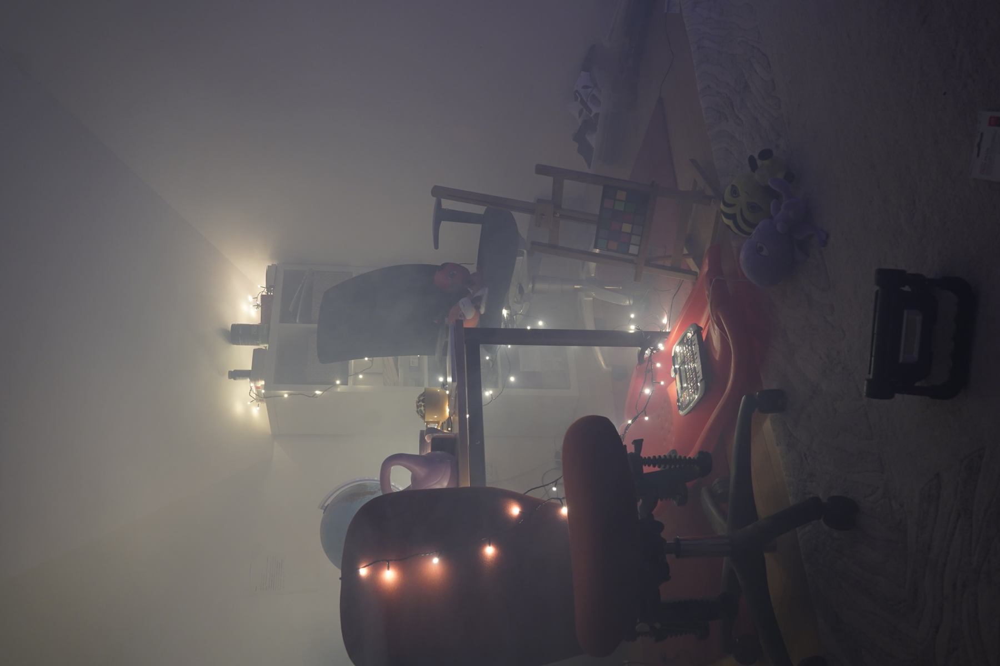
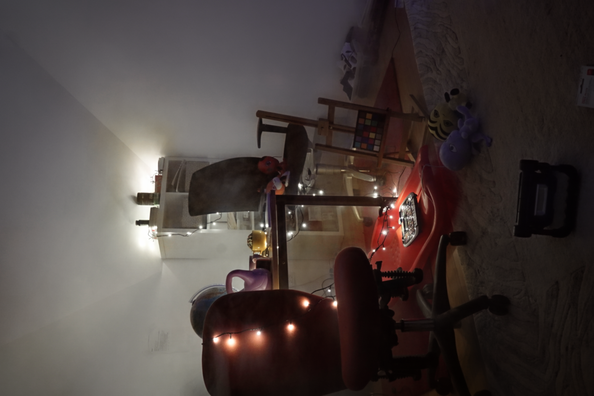

# **Overview**

**DehazeFormer** is a transformer-based architecture for single image dehazing.

Here, we are incorporating the model, *Dehazeformer-B* ,a compressed version of the original Dehazeformer architecture.

### **Qualitative Results**
<table>
  <tr>
    <td>
      <p align="center">Input</p>
      
    </td>
    <td>
      <p align="center">Output</p>
      
    </td>
  </tr>
</table>

*Performance*
- Baseline inference: ~24.78 dB PSNR  
- TTA (test2.py): ~25.08 dB PSNR  

## 1. Installation
```bash
git clone https://github.com/JenyBhatt/Dehazeformer.git
cd Dehazeformer
```
## 2. Install Dependencies
### For Local / VSCode:
```bash
# PyTorch (GPU recommended, CUDA 12.1)
pip install --quiet torch torchvision torchaudio --index-url https://download.pytorch.org/whl/cu121
pip install -r requirements.txt

# Other required libraries
pip install --quiet opencv-python timm pytorch-msssim tqdm tensorboard tensorboardX
```
### For Google Colab:

#### Install PyTorch for Colab GPU runtime
```bash
!pip install --quiet torch torchvision torchaudio --index-url https://download.pytorch.org/whl/cu121
!pip install --quiet opencv-python timm pytorch-msssim tqdm tensorboard tensorboardX
```

## 3. Dataset Preparation

### Organize your images(Local/VsCode):
```bash
Dehazeformer/
├─ data/
│  └─ RESIDE-IN/
│      └─ indoor/       # input images here
├─ saved_models/
│  └─ indoor/           # outputs will be saved here
├─ models/
│  └─ dehazeformer.py
├─ utils/
│  └─ common.py, etc.
├─ test.py
```
### Organize your images(Google Colab):
```bash
Dehazeformer/
├─ data/
│  └─ test/           # Images to dehaze
├─ weights/
│  └─ finetuned_phase3_highres_ema_24.39.pth
```
## Weights/Model
You can download any of the weights as listed <a href="https://drive.google.com/drive/folders/1_sO30A9-vmtcD1b9dzz1yY0b7ixg0pEN?usp=sharing">here</a>
 <br/> 
## Unzip .pth files
```bash
!pip install gdown
!mkdir -p /content/Dehazeformer/weights
!gdown --id 148C5cc-6Y76KfPCE8iJuD3qJKJF-1qTP -O weights.zip
!unzip weights.zip -d /content/Dehazeformer/weights/

!ls /content/Dehazeformer/weights/
```
> Make sure to update the `--weights` path or the variable inside test scripts accordingly.
## 4. Run Inference

**TTA with other configs {PSNR-24.743dB LPIPS-0.1652 SSIM-0.8614}** <br/>
```bash
!python test1.py
```
If you're using this command to run then need to give inputs as args
**Note:** The above configuration uses *test-time augmentation (TTA)*, which may increase inference time.
### Inference Performance

| PSNR (dB)  | SSIM | LPIPS | Runtime (sec) |  
|--------------|--------------|----------|------|
|25.082 | 0.8666 | 0.1697 | ~240s/img | 

<br/>

**Note:**  
- The **TTA configuration** uses multiple augmentations and scales → improves quality but increases runtime.  
- The **standard evaluation** is faster and suitable for quick testing.
For faster inference, you may use the standard evaluation pipeline without TTA:<br/>
**Alternative Inference script:**
### VsCode
```bash
python -m test --model dehazeformer-b --data_dir ./data --save_dir ./saved_models --dataset RESIDE-IN --exp indoor
```
### Google Colab
```bash
!python -m test \
    --model dehazeformer-b \
    --data_dir /content/Dehazeformer/data/test \
    --save_dir /content/Dehazeformer/saved_models \
    --dataset RESIDE-IN \
    --exp indoor \
    --weights /content/Dehazeformer/weights/finetuned_phase3_highres_ema_24.39.pth
```
### Inference Performance

| PSNR (dB)  | SSIM | LPIPS | Runtime (sec) |  
|--------------|--------------|----------|------|
|24.743 | 0.8614  | 0.1652 | ~15s/img | 

<br/>
The weights are available in the pretrained_weights folder.
<br/>
It is recommended to update the weights file path accordingly.


>**Note:** This repository uses the DehazeFormer-B model (a compressed variant) based on the original [DehazeFormer by IDKiro](https://github.com/IDKiro/DehazeFormer). It is a lightweight and computationally efficient variant of the original Dehazeformer, designed to reduce parameters and inference latency while maintaining competitive dehazing performance.
<br/>

```bibtex
@article{song2023vision,
  title={Vision Transformers for Single Image Dehazing},
  author={Song, Yuda and He, Zhuqing and Qian, Hui and Du, Xin},
  journal={IEEE Transactions on Image Processing},
  volume={32},
  pages={1927--1941},
  year={2023},
  publisher={IEEE}
}
